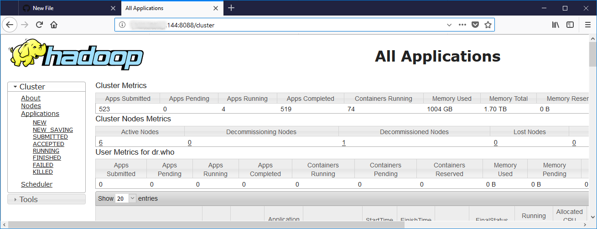
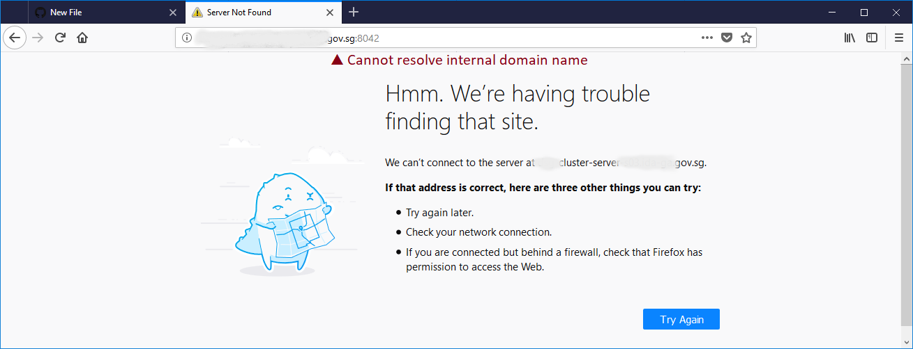
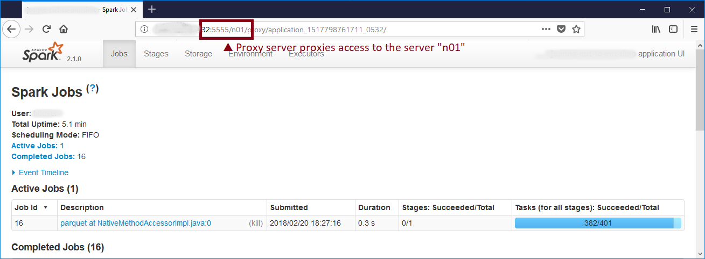

# yarn-reverse-proxy

Reverse proxy for the status pages of a YARN cluster.

If you're running your own Hadoop cluster (e.g. a CDH distribution), you
might recognize the following pages:



If the computer you are using to view the YARN cluster's status pages
is not hooked up to the internal DNS services, as you navigate around
the status pages you will inevitably encounter the following:



This docker image sets up a reverse proxy for your cluster.
The reverse proxy also takes care to re-write the &lt;A> tags, &lt;IMG> tags,
&lt;SCRIPT> tags etc. so that your navigation stays within the reverse proxy.

Enjoy!



## Installation

1. Copy `docker-compose.example.yml` to `docker-compose.yml`.
2. Modify `docker-compose.yml` to match your cluster specs (see below).
3. Start the proxy server by running `docker-compose up`.

### `SERVERS`
The `SERVERS` environment variable is a
whitespace-delimited list of server and ports to set up for the reverse proxy. Each entry has the following format:

```
<SERVER>:<PORT>@<ALIAS>
```

If you run the proxy server on host 192.168.1.1 port 5555, then you can access the status page of `<SERVER>:<PORT>`
at `http://192.168.1.1:5555/<ALIAS>`.

For a typical CDH setup, you will need to proxy:
1. Your *Resource Managers* (both active and passive) at port 8088
2. All your *Node Managers* at port 8042
3. Your *JobHistory Server* at port 19888

### `RESOLVER`
Set `RESOLVER` to the IP address of your cluster's DNS server.

### `SERVER_URL_BASE`
Set `SERVER_URL_BASE` to the URL at which your proxy server will reside, e.g. if you want to
access your status pages at `http://192.168.1.1:5555/<ALIAS>`, then `SERVER_URL_BASE` will be `http://192.168.1.1:5555`.

### `ports: ["5555:80"]`
Set the above property in your `docker-compose.yml` if you want to directly expose the proxy server to
users of your network. **BE EXTREMELY CAREFUL if your cluster is on the Internet** (see below).

## Security
For a non-kerberized cluster, jobs can be killed by anyone via the status pages. If you are using a
non-kerberized cluster (e.g. Amazon EMR) **DO NOT expose the reverse proxy to the Internet**
unless you have at least some security measures in place, e.g. BASIC authentication with HTTPS.
